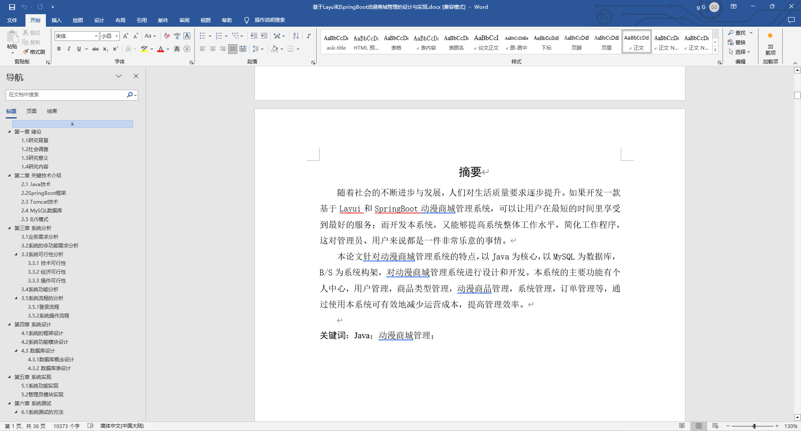
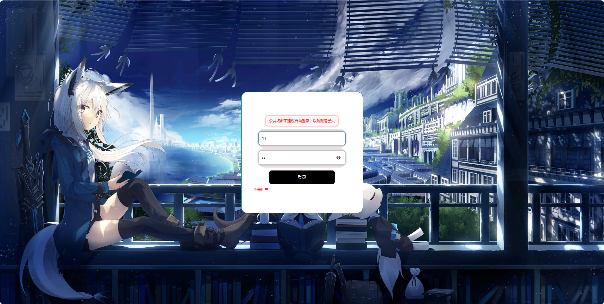
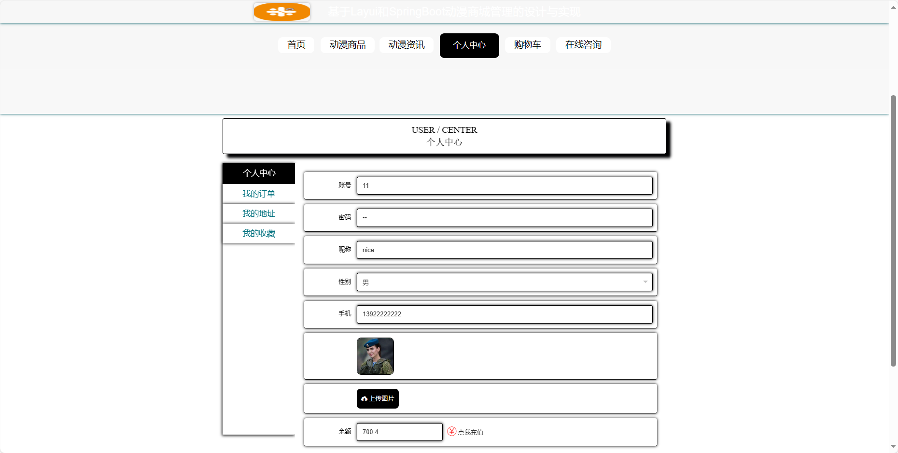
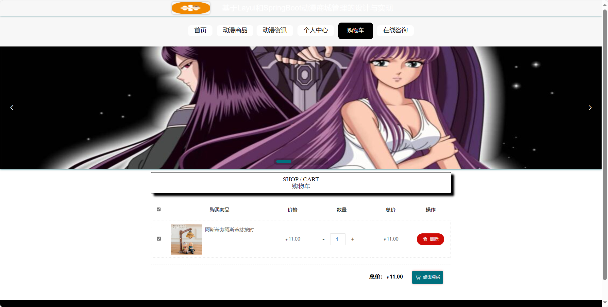
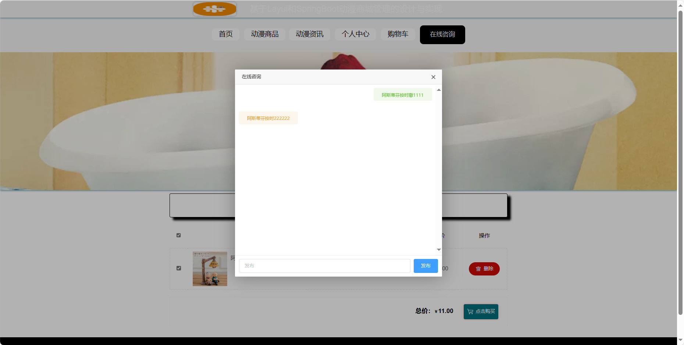
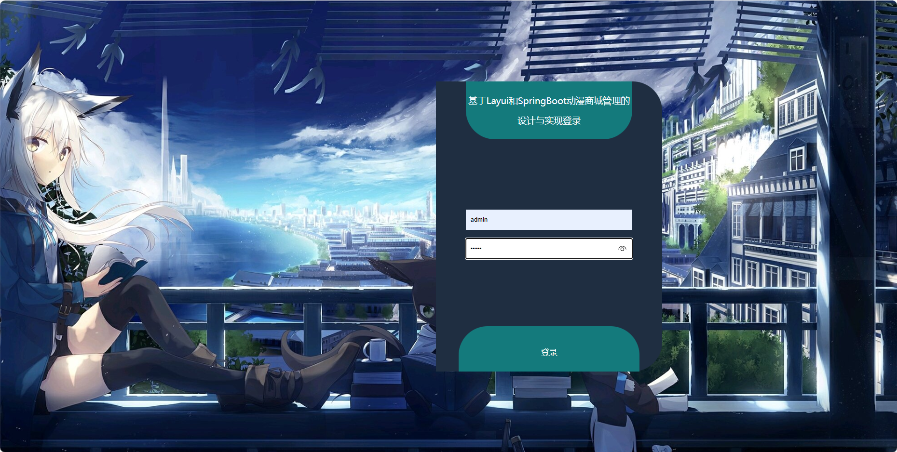
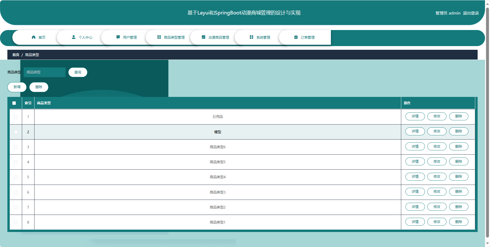
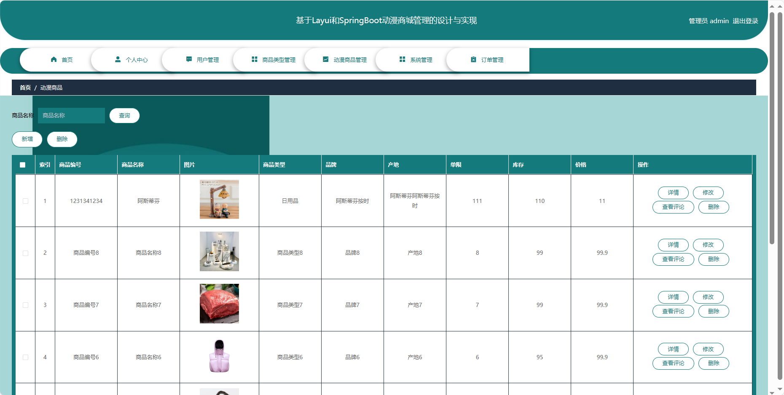

## 基于SpringBoot的动漫商城管理系统(程序+报告)

- <b>完整代码获取地址：从戎源码网 ([https://armycodes.com/](https://armycodes.com/))</b>
- <b>技术探讨、资料分享，请加QQ群：692619798</b> 
- <b>作者微信：19941326836  QQ：952045282</b> 
- <b>承接计算机毕业设计、Java毕业设计、Python毕业设计、深度学习、机器学习</b>
- <b>选题+开题报告+任务书+程序定制+安装调试+论文+答辩ppt 一条龙服务</b>
- <b>所有选题地址 ([https://github.com/YuLin-Coder/AllProjectCatalog](https://github.com/YuLin-Coder/AllProjectCatalog)) </b>

## 项目介绍
基于SpringBoot的动漫商城管理系统，系统包含两种角色：管理员、用户,系统分为前台和后台两大模块，主要功能如下。

### 【管理员】:
1. 首页：提供管理员进入后台管理的入口。
2. 个人中心：管理员可以管理个人信息。
3. 用户管理：查看、编辑、冻结或删除用户账号，管理用户的订单和信息。
4. 商品类型管理：管理员可以管理商品的分类，添加、编辑、删除商品类型。
5. 动漫商品管理：添加、编辑、删除动漫商品信息。
6. 系统管理：管理员可以进行系统的基本设置。
7. 订单管理：查看、处理用户的订单。

### 【前台】:
1. 首页：提供用户进入系统的入口。
2. 动漫商品：用户可以浏览、搜索和筛选各类动漫商品。
3. 动漫资讯：提供最新的动漫相关资讯和新闻。
4. 个人中心：用户可以管理个人信息。
5. 购物车：用户可以查看已选购的商品、添加、删除商品，进行结算。
6. 在线咨询：用户可以通过在线咨询获取关于商品、订单等方面的帮助。

## 项目技术
- 编程语言：Java
- 数据库：MySQL
- 项目管理工具：Maven
- 前端技术：HTML、CSS、JavaScript、Jquery、Vue
- 后端技术：Spring、SpringMVC、MyBatis

## 运行环境
- JDK版本：JDK1.8及以上
- 开发工具：IDEA、Ecplise、Myecplise都可以
- 数据库: MySQL5.7及以上
- Maven：maven3.0及以上
- Node：14.14.0及以上

## 运行截图

